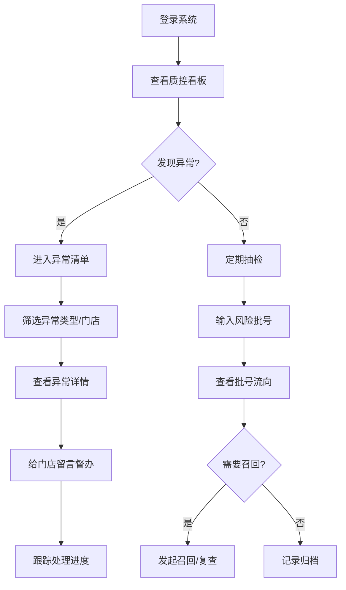

## 1. 产品概述

面向连锁口腔机构质控负责人的 Web 追溯看板，专注于多门店种植体批号流向监控和异常管理，帮助总部实现种植体全生命周期质量管控。

- 核心价值：通过数据驱动的质控管理，降低种植体医疗风险，提升连锁机构合规性
- 目标用户：连锁口腔机构总部质控负责人、区域质控经理

## 2. 核心功能

### 2.1 用户角色

| 角色 | 登录方式 | 核心权限 |
|------|----------|----------|
| 质控负责人 | 账号密码登录 | 查看全部门店数据、发起召回、留言督办 |
| 门店护士 | 账号密码登录 | 仅查看本店数据、补录批号信息 |

### 2.2 功能模块

1. **质控看板**：多维度数据总览、门店排行、筛选分析
2. **批号追踪**：风险批号流向查询、患者追溯、召回管理
3. **异常清单**：自动异常检测、问题分类、留言补正

### 2.3 页面详情

| 页面名称 | 模块名称 | 功能描述 |
|-----------|-------------|---------------------|
| 质控看板 | 数据概览卡片 | 本月种植体使用量、临期库存、未绑定病例数、异常总数 |
| 质控看板 | 门店使用量排行 | 各门店本月使用量柱状图，支持按品牌筛选 |
| 质控看板 | 临期库存预警 | 按门店展示临期（90天内）种植体数量和明细 |
| 质控看板 | 未绑定病例监控 | 展示已出库但未绑定病例的批号，提示"先用后补录"风险 |
| 质控看板 | 筛选器 | 品牌、门店、医生三维筛选，实时联动数据 |
| 批号追踪 | 批号搜索 | 输入供应商风险批号，支持模糊搜索和批量导入 |
| 批号追踪 | 流向列表 | 按门店分组展示：入库时间、患者姓名、牙位、护士、随访状态 |
| 批号追踪 | 召回管理 | 标记召回状态，生成复查清单，导出报告 |
| 异常清单 | 异常分类统计 | 批号缺失、重复绑定、有效期异常、先用后补录四类统计 |
| 异常清单 | 异常明细列表 | 按异常类型、门店、时间筛选的问题清单 |
| 异常清单 | 留言督办 | 给门店发送补正通知，查看处理进度和历史记录 |

## 3. 核心流程

质控负责人日常工作流程：登录系统 → 查看看板概览 → 发现异常门店 → 深入追踪批号 → 定位问题 → 发送补正通知 → 跟踪处理进度

## 4. 用户界面设计

### 4.1 设计风格

- 主色调：深青色（#0D9488）代表医疗专业与信任
- 辅助色：警示橙（#F59E0B）用于临期预警，危险红（#EF4444）用于严重异常
- 中性色： slate 色系，以深灰为背景营造专业数据感
- 整体风格：深色数据仪表盘风格，科技感与医疗专业感结合
- 卡片样式：圆角 12px，微妙阴影，悬停轻微上浮
- 字体：思源黑体 / Inter，清晰易读的等宽数字字体用于数据展示

### 4.2 页面设计概览

| 页面名称 | 模块名称 | UI 元素 |
|-----------|-------------|-------------|
| 质控看板 | 顶部导航 | Logo、三个模块切换、用户信息 |
| 质控看板 | 筛选栏 | 品牌下拉、门店多选、医生下拉、时间范围 |
| 质控看板 | 数据卡片 | 四个指标卡片，带趋势箭头和环比数据 |
| 质控看板 | 图表区域 | 左右两栏布局，左侧柱状图，右侧预警列表 |
| 批号追踪 | 搜索区 | 大号搜索框、历史搜索记录、批量导入按钮 |
| 批号追踪 | 流向面板 | 门店分组的可折叠卡片，时间线式流向展示 |
| 异常清单 | 统计概览 | 四类异常数量卡片，点击筛选 |
| 异常清单 | 异常表格 | 数据表格，支持排序、筛选、分页 |
| 异常清单 | 留言弹窗 | 模态框，留言输入、附件上传、发送记录 |

### 4.3 响应式

- 桌面优先设计，主内容区最小宽度 1200px
- 平板端自适应，表格支持横向滚动
- 移动端简化展示，保留核心数据卡片和列表

### 4.4 动效与交互

- 数据卡片入场：渐入 + 轻微上移，错峰延迟
- 筛选联动：数据平滑过渡（0.3s ease）
- 悬停反馈：卡片 2px 上浮 + 阴影加深
- 异常闪烁：严重异常项轻微脉冲动画，引导注意力
