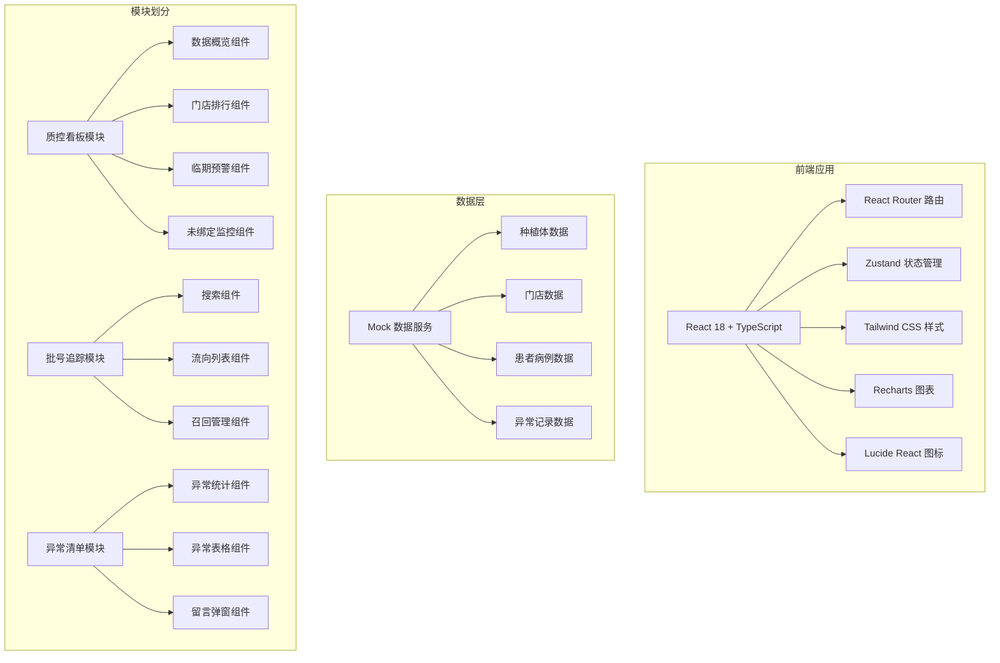
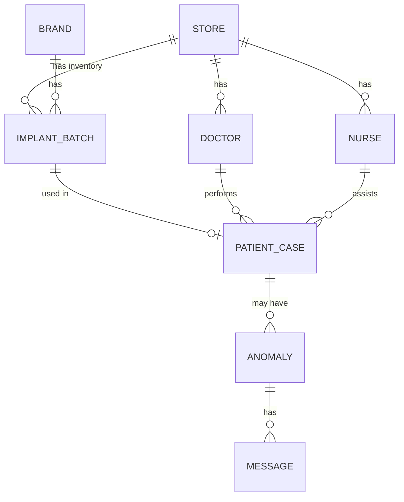

## 1. 架构设计



## 2. 技术描述

- 前端：React 18 + TypeScript + Vite 5
- 路由：react-router-dom 6
- 状态管理：zustand 4
- 样式：Tailwind CSS 3
- 图表：recharts 2
- 图标：lucide-react
- 数据：Mock 数据模拟（无真实后端）

## 3. 路由定义

| 路由 | 页面 | 说明 |
|-------|------|------|
| / | 质控看板 | 默认首页，数据总览和多维度分析 |
| /tracking | 批号追踪 | 风险批号流向查询和召回管理 |
| /anomalies | 异常清单 | 异常检测和留言督办 |

## 4. 数据模型

### 4.1 核心数据类型

```typescript
// 门店
interface Store {
  id: string;
  name: string;
  city: string;
  address: string;
}

// 种植体品牌
interface Brand {
  id: string;
  name: string;
  country: string;
}

// 种植体批号
interface ImplantBatch {
  id: string;
  batchNumber: string;
  brandId: string;
  productName: string;
  spec: string;
  expiryDate: string;
  quantity: number;
  storeId: string;
  inboundDate: string;
}

// 医生
interface Doctor {
  id: string;
  name: string;
  storeId: string;
  title: string;
}

// 护士
interface Nurse {
  id: string;
  name: string;
  storeId: string;
}

// 患者病例
interface PatientCase {
  id: string;
  patientName: string;
  patientId: string;
  storeId: string;
  doctorId: string;
  nurseId: string;
  implantBatchId: string;
  toothPosition: string;
  surgeryDate: string;
  followUpStatus: 'pending' | 'completed' | 'failed';
  followUpDate?: string;
}

// 异常记录
interface Anomaly {
  id: string;
  type: 'missing' | 'duplicate' | 'expiry' | 'unbound';
  severity: 'high' | 'medium' | 'low';
  storeId: string;
  batchNumber?: string;
  description: string;
  caseId?: string;
  discoveredAt: string;
  status: 'open' | 'processing' | 'resolved';
  messages: Message[];
}

// 留言
interface Message {
  id: string;
  anomalyId: string;
  sender: string;
  senderRole: 'headquarters' | 'store';
  content: string;
  createdAt: string;
}

// 看板统计数据
interface DashboardStats {
  totalUsage: number;
  expiringStock: number;
  unboundBatches: number;
  totalAnomalies: number;
  monthOverMonth: {
    usage: number;
    expiring: number;
    unbound: number;
    anomalies: number;
  };
}
```

### 4.2 数据实体关系图



## 5. 项目目录结构

```
src/
├── components/          # 公共组件
│   ├── Layout/         # 布局组件
│   ├── Card/           # 数据卡片
│   ├── FilterBar/      # 筛选栏
│   ├── StatusBadge/    # 状态标签
│   └── DataTable/      # 数据表格
├── pages/              # 页面
│   ├── Dashboard/      # 质控看板
│   ├── Tracking/       # 批号追踪
│   └── Anomalies/      # 异常清单
├── store/              # 状态管理
│   ├── useDashboardStore.ts
│   ├── useTrackingStore.ts
│   └── useAnomalyStore.ts
├── data/               # Mock 数据
│   ├── stores.ts
│   ├── brands.ts
│   ├── batches.ts
│   ├── doctors.ts
│   ├── nurses.ts
│   ├── cases.ts
│   └── anomalies.ts
├── types/              # 类型定义
│   └── index.ts
├── utils/              # 工具函数
│   ├── date.ts
│   └── format.ts
├── App.tsx
├── main.tsx
└── index.css
```

## 6. 状态管理设计

### 6.1 Dashboard Store
- 筛选条件（品牌、门店、医生、时间范围）
- 看板统计数据
- 门店使用量排行数据
- 临期库存数据
- 未绑定病例数据

### 6.2 Tracking Store
- 搜索关键字
- 批号流向结果
- 选中的批号详情
- 召回状态管理

### 6.3 Anomaly Store
- 异常列表
- 异常分类统计
- 当前筛选的异常类型
- 留言记录
